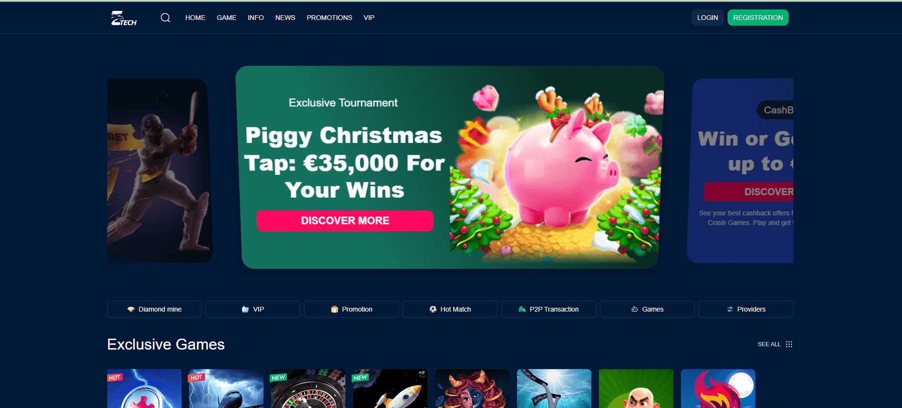
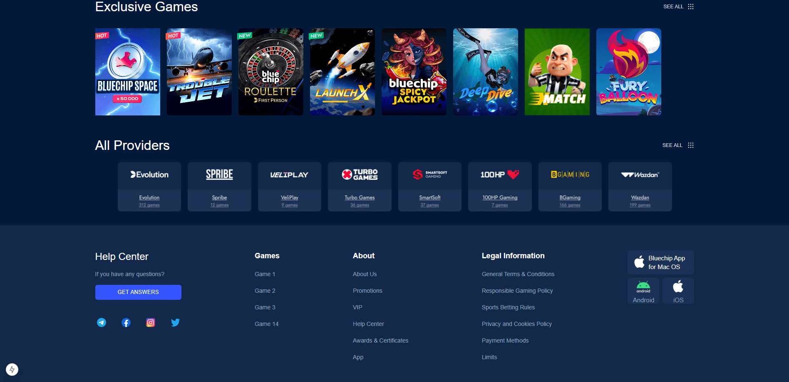
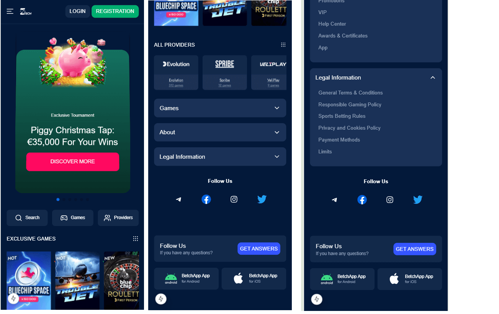

# Z Tech - Game online

## Trang chủ



## Trang nội dung và thể loại game



## Công nghệ sử dụng

- **Next.js**: Framework React cho phát triển web hiện đại
- **Tailwind CSS**: Framework CSS tiện ích để tạo giao diện tùy chỉnh
- **TypeScript**: Ngôn ngữ lập trình JavaScript với kiểu dữ liệu tĩnh
- **Vercel**: Nền tảng triển khai cho ứng dụng Next.js

## Cấu trúc dự án

- **/app**: Cấu trúc ứng dụng Next.js với định tuyến dựa trên tệp
- **/components**: Các thành phần UI có thể tái sử dụng
- **/assets**: Hình ảnh, biểu tượng và tài nguyên tĩnh
- **/mockData**: Mock dữ liệu

## Phiên bản di động



## Bắt đầu

Đầu tiên, chạy máy chủ phát triển:

```bash
npm run dev
# hoặc
yarn dev
# hoặc
pnpm dev
# hoặc
bun dev
```

Mở [http://localhost:3000](http://localhost:3000) với trình duyệt của bạn để xem kết quả.
